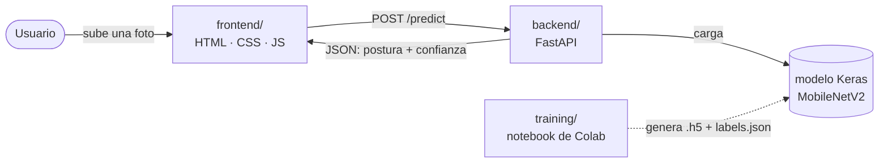

<div align="center">

# 🧘 Sistema de Reconocimiento de Posturas de Yoga

**Clasificación de posturas de yoga en imágenes mediante transfer learning (MobileNetV2), servida a través de una API y una interfaz web.**


</div>

---

## Índice

- [Descripción](#descripción)
- [Arquitectura](#arquitectura)
- [Resultados del modelo](#resultados-del-modelo)
- [Puesta en marcha](#puesta-en-marcha)
- [Referencia de la API](#referencia-de-la-api)
- [Pruebas](#pruebas)
- [Diferencias con el notebook académico original](#diferencias-con-el-notebook-académico-original)
- [Limitaciones conocidas](#limitaciones-conocidas)
- [Estructura del repositorio](#estructura-del-repositorio)
- [Capturas](#capturas)

---

## Descripción

Esta aplicación identifica cuál de **5 posturas de yoga** aparece en una foto:

| Clase (API) | Postura         |
|:------------|:-----------------|
| `downdog`   | Perro boca abajo |
| `goddess`   | Diosa            |
| `plank`     | Plancha          |
| `tree`      | Árbol            |
| `warrior2`  | Guerrero II      |

El proyecto nace de la actividad académica *"Evaluemos un modelo de clasificación"* (Maestría en
IA — Visión por Computador): un notebook de Colab que entrena un clasificador de imágenes con
transfer learning sobre MobileNetV2, usando el dataset
[`niharika41298/yoga-poses-dataset`](https://www.kaggle.com/datasets/niharika41298/yoga-poses-dataset)
de Kaggle. Este repositorio toma ese notebook y lo convierte en una **aplicación completa**:
pipeline de entrenamiento corregido, API de inferencia y una interfaz web para subir una foto y
ver la predicción en vivo.

## Arquitectura



| Carpeta | Responsabilidad |
|:--------|:-----------------|
| [`training/`](training/) | Notebook de Colab que descarga el dataset, entrena el modelo (MobileNetV2 + fine-tuning) y exporta `modelo_yoga_kaggle.h5`, `labels.json` y `model_metrics.json`. Incluye también `train_local.py` como alternativa a Colab. |
| [`backend/`](backend/) | API en FastAPI que carga el modelo entrenado y expone `POST /predict` para clasificar una imagen subida. |
| [`frontend/`](frontend/) | Página web estática (sin frameworks) que sube la imagen, llama a la API y muestra el resultado con la confianza y probabilidades por clase. |
| [`samples/`](samples/) | Imágenes de ejemplo para probar la app manualmente. |

## Resultados del modelo

Métricas del modelo actual, medidas sobre el conjunto de **TEST real** (no reutiliza el split de
validación) — detalle completo en [`backend/models/model_metrics.json`](backend/models) una vez
entrenado:

| Postura   | Precisión | Recall | F1-score |
|:----------|:---------:|:------:|:--------:|
| downdog   | 0.859     | 0.876  | 0.867    |
| goddess   | 0.598     | 0.725  | 0.655    |
| plank     | 0.910     | 0.704  | 0.794    |
| tree      | 0.714     | 0.942  | 0.812    |
| warrior2  | 0.840     | 0.725  | 0.778    |
| **Global**| —         | —      | **78.3% accuracy** |

**Interpretación en simple:**

- En promedio, el modelo **acierta en 78 de cada 100 fotos**.
- **`downdog`** (F1 0.867) y **`tree`** (F1 0.812) son las posturas que mejor reconoce — pocas
  veces se equivoca con ellas, en cualquier dirección.
- **`goddess`** es la más problemática (F1 0.655): su precisión es baja (0.598), es decir, cuando
  el modelo dice "goddess" acierta poco más de la mitad de las veces. La causa concreta, según la
  matriz de confusión, es que confunde bastante `warrior2` con `goddess` (23 casos) y en menor
  medida `plank` con `goddess` (11 casos) — probablemente porque comparten brazos/piernas abiertos
  en el encuadre.
- **`plank`** y **`warrior2`** tienen precisión alta (0.91 y 0.84: cuando el modelo las predice,
  casi siempre acierta) pero recall más bajo (0.70 y 0.72): a veces fotos reales de esas posturas
  las clasifica como otra cosa (típicamente como `goddess`), es decir, le cuesta más *encontrarlas*
  que *confirmarlas*.
- En la práctica: confía más en el resultado cuando el modelo predice `downdog` o `tree`; tómalo
  con más cautela cuando predice `goddess`, especialmente si la confianza mostrada es baja.

## Puesta en marcha

1. **Entrenar el modelo** — en Colab (GPU, recomendado) o localmente con `training/train_local.py`
   (CPU, más lento). Sigue [`training/README.md`](training/README.md). Al final tendrás 3 archivos:
   `modelo_yoga_kaggle.h5`, `labels.json`, `model_metrics.json`.
2. **Colocar el modelo** — copia esos 3 archivos a `backend/models/`.
3. **Levantar la API** — sigue [`backend/README.md`](backend/README.md) (crear venv con Python
   3.13, instalar dependencias, `uvicorn app.main:app --reload --port 8000`).
4. **Levantar el frontend** — sigue [`frontend/README.md`](frontend/README.md)
   (`python -m http.server 5500` dentro de `frontend/`), abre http://localhost:5500.
5. Sube una imagen de `samples/` (o cualquier foto de una de las 5 posturas) y presiona
   **"Analizar postura"**.

> El único paso que no se puede automatizar desde este repositorio es el 1–2: entrenar requiere
> GPU (o tiempo en CPU) y credenciales de Kaggle, así que se hace aparte y luego se copian los
> artefactos generados.

## Referencia de la API

| Método | Ruta       | Descripción                                              |
|:-------|:-----------|:-----------------------------------------------------------|
| `GET`  | `/health`  | Estado del servicio y si el modelo está cargado             |
| `GET`  | `/classes` | Lista de posturas reconocidas                                |
| `POST` | `/predict` | Sube una imagen (`multipart/form-data`, campo `file`) y devuelve la predicción |

<details>
<summary><strong>Ejemplo de respuesta de <code>POST /predict</code></strong></summary>

```json
{
  "pose": "downdog",
  "confidence": 0.94,
  "probabilities": {
    "downdog": 0.94,
    "goddess": 0.01,
    "plank": 0.02,
    "tree": 0.01,
    "warrior2": 0.02
  }
}
```

</details>

Documentación interactiva (Swagger UI) disponible en `http://localhost:8000/docs` una vez que la
API está corriendo. Detalles completos en [`backend/README.md`](backend/README.md).

## Pruebas

```powershell
cd backend
.\.venv\Scripts\Activate.ps1
pytest
```

Las pruebas de la API usan un modelo Keras diminuto generado en memoria (no el modelo real de
producción), por lo que no requieren haber entrenado el modelo para poder correrlas.

## Diferencias con el notebook académico original

El notebook original (conservado como referencia en
[`training/ACTIVIDAD_5__Evaluemos_un_modelo_de_clasificación_original.ipynb`](training/)) tenía
varios problemas de rigor de ML que se corrigieron en
[`training/Entrenamiento_Modelo_Yoga.ipynb`](training/Entrenamiento_Modelo_Yoga.ipynb):

- Entrenamiento sin control (100 épocas fijas, sin early stopping) → se agregan `EarlyStopping`,
  `ModelCheckpoint` y `ReduceLROnPlateau`, más una etapa de fine-tuning.
- Evaluación final reutilizando el split de validación en vez de un conjunto de TEST real → ahora
  se evalúa sobre el TEST real.
- Se agrega data augmentation para reducir sobreajuste en un dataset pequeño.
- `class_names` se deriva una sola vez y se exporta a `labels.json`, en vez de hardcodearse.

El detalle completo está en la primera celda de ese notebook y en
[`training/README.md`](training/README.md).

## Limitaciones conocidas

- Solo reconoce las 5 posturas del dataset de entrenamiento — cualquier otra postura se clasifica
  igual como la más parecida de esas 5 (el modelo no tiene una clase "ninguna" ni umbral de
  rechazo).
- Clasifica **imágenes estáticas**, no video en tiempo real ni landmarks corporales (no usa
  MediaPipe ni similares).
- El dataset de Kaggle tiene su propia licencia de uso — revisar antes de cualquier uso comercial.

## Estructura del repositorio

```
├── README.md
├── samples/            # imágenes de ejemplo
├── training/           # notebook de entrenamiento (Colab) + train_local.py + README
├── backend/            # API FastAPI (código, tests, README)
└── frontend/           # interfaz web estática (HTML/CSS/JS, README)
```

## Capturas


